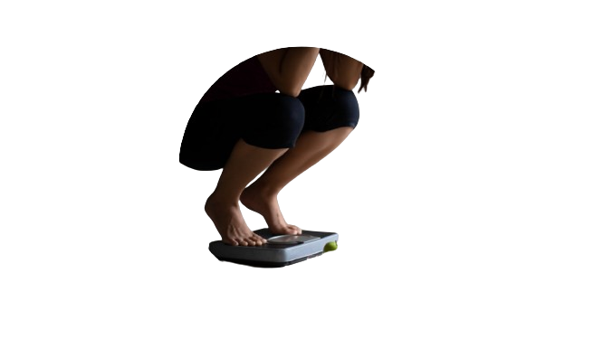

### Bem-vindo(a) ao md do <a target="_blank" href="https://github.com/LuccasPoontes"> LuccasPoontes </a> 😁 👋

<h1 align = "center">About Projeto do Luccas Pontes💻 </h1>

- 🎓 Analise e desenvolvimento de sistemas - ADS <br>
- 😄 Acredita que todos desafios é possivel se realizar! <br>
- 📊<a target="_blank" href="https://luccaspoontes.github.io/3.IMC_JS_HTML_CSS/"> Acesso ao projeto </a> <br>

## IDE's preview:
<div style="display: inline_block">


 

</div>

<br>

<h1 align = "center">Calculadora IMC - Corporal </h1>

## Descrição

Este projeto é uma aplicação web simples que calcula o Índice de Massa Corporal (IMC) de um usuário com base na sua altura e peso. A aplicação fornece uma classificação de acordo com o valor do IMC calculado. O projeto está hospedado no GitHub Pages e pode ser acessado [aqui](https://luccaspoontes.github.io/3.IMC_JS_HTML_CSS/).

## Estrutura do Projeto

O projeto consiste em três arquivos principais:

1. `index.html` - Estrutura HTML da página.
2. `style.css` - Estilos CSS para a página.
3. `script.js` - Código JavaScript para manipulação do DOM e cálculo do IMC.


## Funcionalidades

- **Formulário de Entrada**: Permite que o usuário insira sua altura e peso.
- **Cálculo do IMC**: Calcula o IMC com base nos valores fornecidos pelo usuário.
- **Classificação do IMC**: Classifica o IMC em diferentes categorias (e.g., Saudável, Sobrepeso).
- **Limpar Formulário**: Permite que o usuário limpe os campos do formulário.

## Como Usar

1. Acesse o projeto [aqui](https://luccaspoontes.github.io/3.IMC_JS_HTML_CSS/).
2. Insira sua altura e peso nos campos apropriados.
3. Clique no botão "Calcular IMC" para ver o resultado do seu IMC e a classificação correspondente.
4. Use o botão "Limpar" para resetar os campos do formulário.

## Estrutura de Arquivos

### index.html

```html
<!DOCTYPE html>
<html lang="pt-br">
<head>
    <meta charset="UTF-8">
    <meta name="viewport" content="width=device-width, initial-scale=1.0">
    <title>Calculadora IMC - Corporal</title>
    <link rel="icon" href="./imagens/imagem_titulo.png" type="image/x-icon">
    <link rel="stylesheet" href="style.css">
</head>
<body>
    <div class="container">
        
        <h1 class="titulario minha-secao" onclick="toggleFieldset()">Consulte sua Saúde!</h1>

        <form id="imcForm" action="/calcular_imc" method="post">
            <fieldset id="informacoesPaciente">
                <legend>Informações sobre o Paciente</legend>
                <div class="img_regua">
                    <label for="altura">
                        
                        Altura (m):
                    </label>
                    <input type="text" id="altura" name="altura" required placeholder="Exemplo: 1.60"><br>
                </div>
                <div class="img_balanca">
                    <label for="peso">
                        
                        Peso (Kg):
                    </label>
                    <input type="text" id="peso" name="peso" required placeholder="Exemplo: 45.830"><br>
                </div>
                <div class="button-container">
                    <button type="submit">
                        
                        Calcular IMC
                    </button>
                    <button type="button" onclick="limparFormulario()">Limpar</button>
                </div>
            </fieldset>
        </form>
    </div>

    <footer>
        &copy; 2024 <a href="https://github.com/LuccasPoontes" target="_blank">Luccas Pontes</a>. Todos os direitos reservados.
    </footer>

    <script src="script.js"></script>
    <script>
        function toggleFieldset() {
            var fieldset = document.getElementById('informacoesPaciente');
            fieldset.style.display = (fieldset.style.display === 'none') ? 'block' : 'none';
        }

        function limparFormulario() {
            document.getElementById('imcForm').reset();
        }
    </script>
</body>
</html>
```
### style.css
```css
body {
    display: flex;
    flex-direction: column;
    justify-content: center;
    align-items: center;
    height: 100vh;
    margin: 0;
    background-color: #ebe6ea;
}

.container {
    text-align: center;
    width: 90%;
    max-width: 600px;
    flex: 1;
}

.entrada_titulo {
    display: block;
    margin: 20px auto;
    width: 100%;
    max-width: 200px;
    height: auto;
}

.titulario {
    margin: 20px auto;
    font-size: 1.5rem;
    text-align: center;
}

fieldset {
    display: none;
    border: 1px solid #ccc;
    padding: 10px;
    margin-top: 10px;
    border-radius: 5px;
    text-align: left;
}

.button-container {
    display: flex;
    align-items: center;
    justify-content: center;
    gap: 10px;
    margin-top: 20px;
}

.button-container button {
    padding: 10px 20px;
    font-size: 1rem;
    cursor: pointer;
    position: relative;
    display: flex;
    align-items: center;
    justify-content: center;
}

.img_calculadora {
    width: 15px;
    height: auto;
    margin-right: 5px;
}

.img_regua, .img_balanca {
    display: flex;
    align-items: center;
    justify-content: center;
    margin: 10px 0;
}

.icone-altura, .icone-balanca {
    width: 30px;
    height: auto;
    margin-right: 10px;
}

.minha-secao_head {
    background-color: #e4c5c4;
    padding: 20px;
    border-radius: 5px;
}

.minha-secao {
    background-color: #e4c5c4;
    padding: 10px;
    border-radius: 20px;
    cursor: pointer;
}

.input-container label {
    display: block;
    margin-bottom: 5px;
}

.input-container {
    position: relative;
}

footer {
    width: 900%;
    text-align: center;
    padding: 5px;
    background-color: #e19ff7;
    color: #fff;
    position: absolute;
    bottom: 0;
}

footer a {
    color: #fff;
    text-decoration: none;
    font-weight: bold;
}

footer a:hover {
    text-decoration: underline;
}

@media (min-width: 768px) {
    .titulario {
        font-size: 2rem;
    }
    .entrada_titulo {
        max-width: 300px;
    }
}
```
### script.js
```js
document.addEventListener('DOMContentLoaded', function () {
    const form = document.querySelector('form');

    form.addEventListener('submit', function (event) {
        event.preventDefault(); // Evita que o formulário seja enviado normalmente

        // Obtém os valores de altura e peso do formulário
        const altura = parseFloat(document.getElementById('altura').value);
        const peso = parseFloat(document.getElementById('peso').value);

        // Verifica se ambos os campos foram preenchidos
        if (isNaN(altura) || isNaN(peso)) {
            alert('Por favor, preencha ambos os campos de altura e peso.');
            return;
        }

        // Calcula o IMC
        const imc = peso / Math.pow(altura, 2);

        // Classifica o resultado
        let classificacao = "";
        if (imc < 16) {
            classificacao = "Magreza grave";
        } else if (imc >= 16 && imc <= 17) {
            classificacao = "Magreza moderada";
        } else if (imc > 17 && imc <= 18.5) {
            classificacao = "Magreza leve";
        } else if (imc > 18.5 && imc <= 24.9) {
            classificacao = "Saudável";
        } else if (imc > 24.9 && imc <= 29.9) {
            classificacao = "Sobrepeso";
        } else if (imc > 29.9 && imc <= 39.9) {
            classificacao = "Obesidade Grau I";
        } else if (imc > 40) {
            classificacao = "Obesidade Grau II (severa)";
        } else {
            classificacao = "Obesidade Grau III (mórbida)";
        }

        // Exibe o resultado em um pop-up
        alert(`Seu IMC é: ${imc.toFixed(2)}\nClassificação: ${classificacao}`);
    });
});

function limparFormulario() {
    document.getElementById('imcForm').reset();
}
```

<br>

## Contribuições
Se você gostaria de contribuir para este projeto, sinta-se à vontade para fazer um fork do repositório, fazer suas alterações e enviar um pull request. Toda ajuda é bem-vinda!

## Licença
Este projeto está licenciado sob a licença MIT. Veja o arquivo LICENSE para mais detalhes.


###  Pra me conhecer me segue nas redes abaixo!
 
<div> 
  <a href="https://instagram.com/error13luccas" target="_blank"></a>
  <a href="mailto:luccasxx13@outlook.com">
</a>
  <a href="https://www.linkedin.com/in/luccas-pontes-faustino-50300b13a/" target="_blank"></a>
</div>


<div align="center">
<br><p align="center"><b>Você é meu visitante virtual nº</b></p>  
<p align="center"></p> 
<br>
</div>


